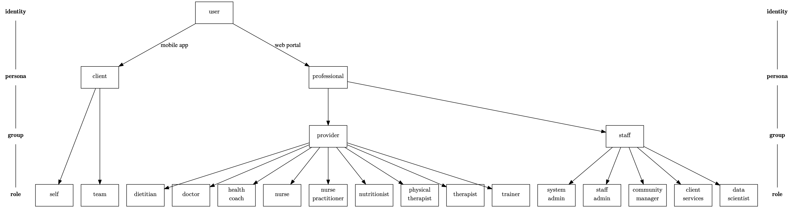

.. _db_models:

Database models
===============

All *identities* in the database are of type **User**. A User has a *persona* **Client** or **Professional** (or both, but only one persona can be logged in per session). A professional persona belong to a *group*, **Staff** or **Practitioner**. Within a *group*, a professional has one or more *roles*:

Entities
--------

.. toctree::

   User <odyssey.api.user.models>
   Client <odyssey.api.client.models>
   Staff <odyssey.api.staff.models>

Roles
-----

.. toctree::

   Doctor <odyssey.api.doctor.models>
   Physical therapist <odyssey.api.physiotherapy.models>
   Trainer <odyssey.api.trainer.models>

Other
-----

.. toctree::

   Wearable devices <odyssey.api.wearables.models>
   Notifications <odyssey.api.notifications.models>
   Telehealth <odyssey.api.telehealth.models>
   System config <odyssey.api.system.models>
   Facilities <odyssey.api.facility.models>
   Lookup tables <odyssey.api.lookup.models>
